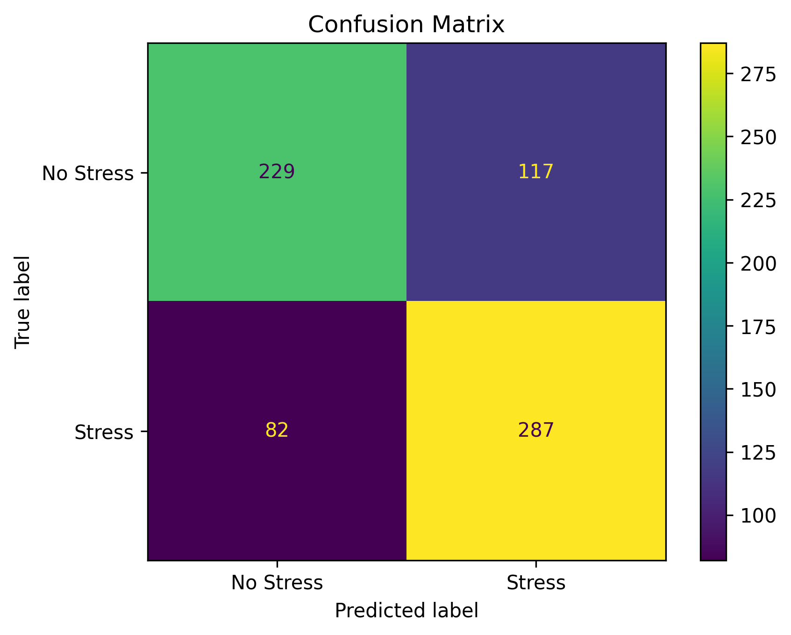
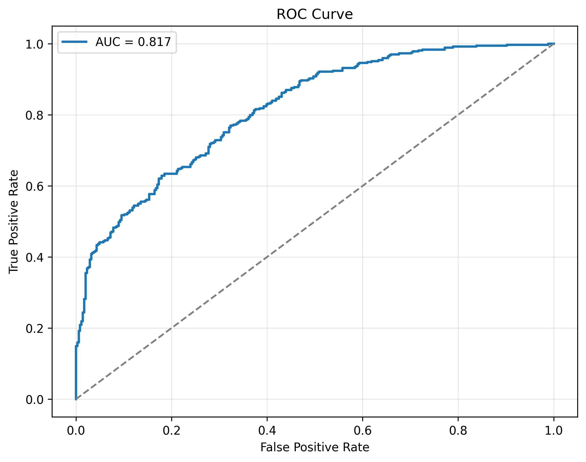
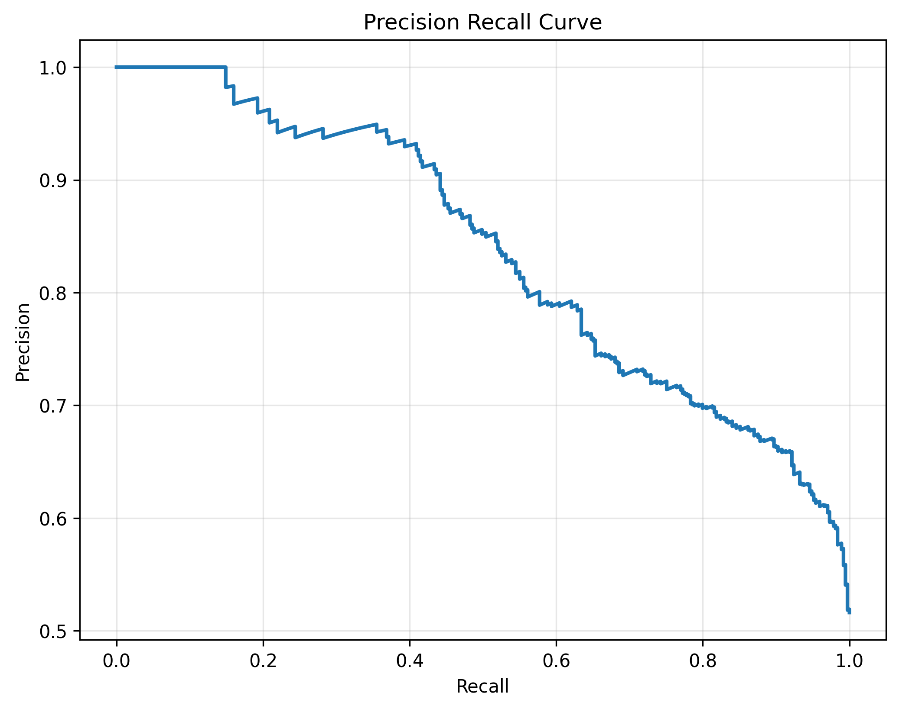
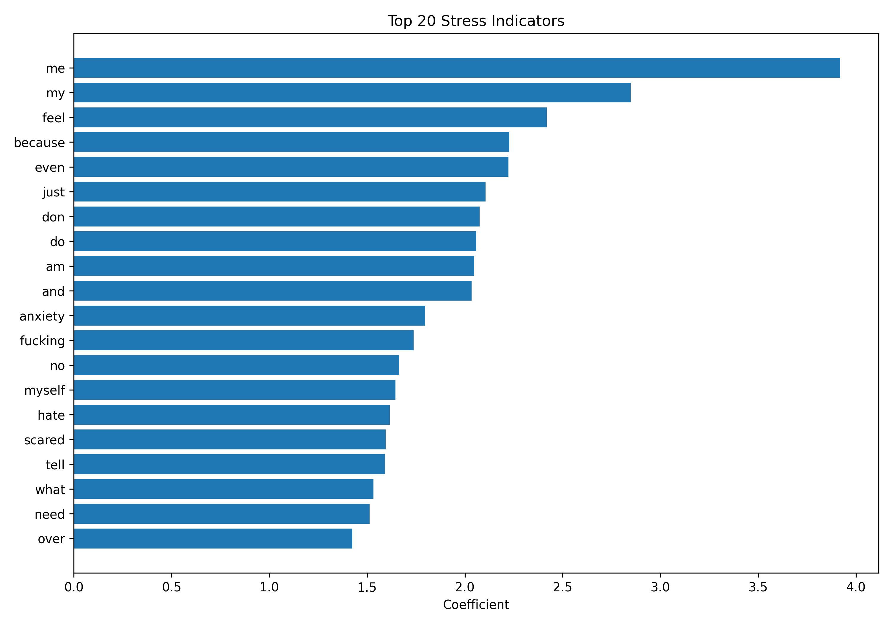
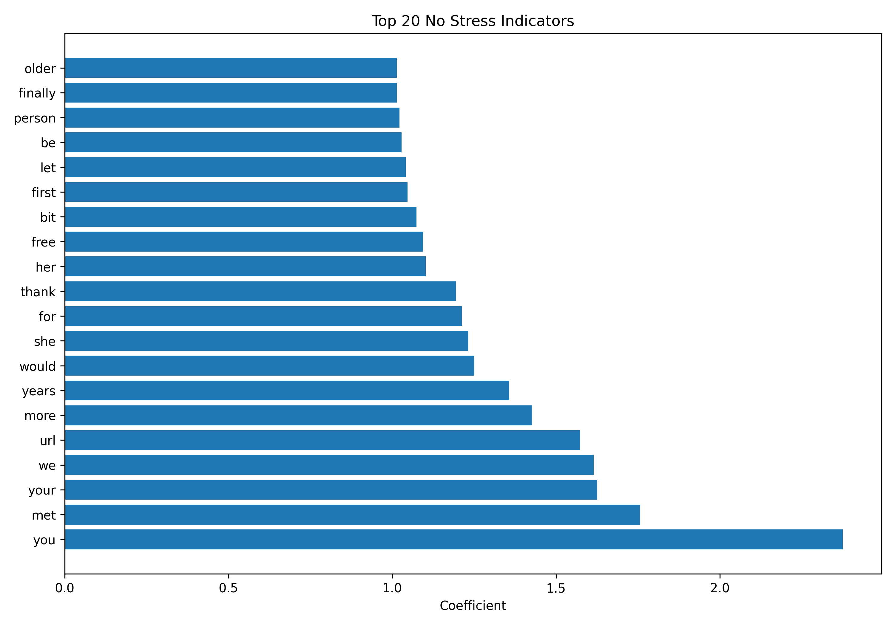

# Reddit Mental Health Stress Detection

An end-to-end Machine Learning application that detects whether a Reddit post expresses **Stress** or **No Stress** using Natural Language Processing (NLP).

The project demonstrates the complete lifecycle of an ML application—from data preprocessing to model training, evaluation, visualization, automated testing, CI/CD, and deployment.

---

## Project Overview

This application classifies Reddit posts into one of two categories:

- Stress
- No Stress

The complete pipeline includes:

- Data preprocessing
- Text cleaning
- TF-IDF Vectorization
- Logistic Regression classifier
- Evaluation metrics
- Visualization generation
- Streamlit application
- Automated testing
- GitHub Actions CI/CD

---

# Features

- End-to-End NLP Pipeline
- Automatic Text Cleaning
- TF-IDF Feature Engineering
- Logistic Regression Model
- Prediction Probabilities
- Model Evaluation
- Confusion Matrix
- ROC Curve
- Precision-Recall Curve
- Top Stress Words
- Top No-Stress Words
- Unit Tests using Pytest
- GitHub Actions CI Pipeline
- Production Ready Folder Structure

---

# Project Structure

```
reddit-mh-classifier/

assets/
│
├── confusion_matrix.png
├── roc_curve.png
├── precision_recall_curve.png
├── top_stress_words.png
├── top_no_stress_words.png
├── metrics.json
└── classification_report.txt

data/
│
├── raw/
└── processed/

model/
│
└── stress_detection_pipeline.pkl

src/
│
├── preprocess.py
├── train.py
├── evaluate.py
├── visualization.py
├── predict.py

tests/
│
├── test_preprocess.py
├── test_pipeline.py
├── test_predict.py
└── test_model_files.py

app.py

README.md
```

---

# Machine Learning Pipeline

```
Raw Dataset
      │
      ▼
Text Cleaning
      │
      ▼
TF-IDF Vectorizer
      │
      ▼
Logistic Regression
      │
      ▼
Prediction
      │
      ├── Metrics
      ├── Evaluation
      └── Visualizations
```

---

# Dataset

Dataset Source

Stress Analysis in Social Media Dataset (Dreaddit)

Downloaded automatically inside GitHub Actions using Kaggle API.

Classes

- Stress
- No Stress

---

# Tech Stack

Programming

- Python

Libraries

- Pandas
- NumPy
- Scikit-Learn
- Matplotlib
- WordCloud
- Joblib

Testing

- Pytest
- Pytest-Cov

Deployment

- Streamlit

Automation

- GitHub Actions

Version Control

- Git
- GitHub

---

# Model Performance

| Metric | Score |
|---------|-------|
| Accuracy | 72.17% |
| Precision | 71.04% |
| Recall | 77.78% |
| F1 Score | 74.26% |

---

# Visualizations

## Confusion Matrix



---

## ROC Curve



---

## Precision Recall Curve



---

## Top Stress Words



---

## Top No Stress Words



---

# Testing

The project contains 24 automated unit tests.

Coverage includes:

- Text preprocessing
- Prediction pipeline
- Model loading
- Saved artifacts
- Pipeline integrity

Run tests

```bash
pytest -v
```

---

# Continuous Integration

GitHub Actions automatically performs:

- Install dependencies
- Configure Kaggle API
- Download dataset
- Preprocess data
- Train model
- Evaluate model
- Generate visualizations
- Execute unit tests

---

# Installation

Clone repository

```bash
git clone https://github.com/ayushthakur24/reddit-mh-classifier.git
```

Install dependencies

```bash
pip install -r requirements.txt
```

Run preprocessing

```bash
python -m src.preprocess
```

Train model

```bash
python -m src.train
```

Evaluate

```bash
python -m src.evaluate
```

Visualizations

```bash
python -m src.visualization
```

Launch Streamlit

```bash
streamlit run app.py
```

---

# Future Improvements

- BERT based classifier
- DistilBERT Fine-tuning
- Docker deployment
- Hugging Face deployment
- FastAPI REST API
- Batch Prediction API
- Explainable AI using SHAP
- MLflow experiment tracking
- Model Monitoring
- Kubernetes deployment

---

# License

MIT License

---

# Author

Ayush Thakur

Senior Software Development Engineer

GitHub:
https://github.com/ayushthakur24